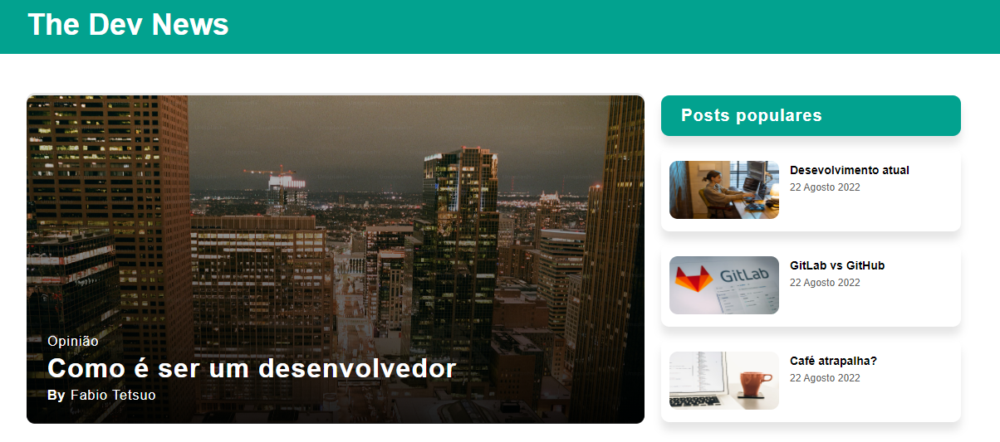

<p align="center">
  
  <p align="center"><strong>Blog Responsivo</strong></p>
</p>

# Blog Responsivo

Este repositório contém o projeto de um **Blog Responsivo**, desenvolvido com o objetivo de oferecer uma experiência de leitura fluida e agradável em dispositivos de diferentes tamanhos de tela. O design se adapta de forma eficiente para garantir usabilidade e acessibilidade, seja em desktops, tablets ou smartphones.

## Sumário

1. [Descrição](#descrição)
2. [Onjetivo do Projeto](#objetivo-do-projeto)
3. [Demostração](#demonstração)
4. [Funcionalidades](#funcionalidades)
5. [Tecnologias Utilizadas](#tecnologias-utilizadas)
6. [Estrutura de Pastas](#estrutura-de-pastas)
7. [Desenvolvedor](#desenvolvedor)

## Descrição

O Blog Responsivo é um projeto de desenvolvimento front-end focado na criação de um blog com design adaptável a diferentes tamanhos de tela. O objetivo é garantir que o conteúdo seja acessível e visualmente agradável em dispositivos como desktops, tablets e smartphones.

## Objetivo do Projeto

Este projeto visa aplicar boas práticas de desenvolvimento web, com foco em responsividade e acessibilidade, além de proporcionar uma experiência de leitura fluida e uma navegação intuitiva para os usuários.

## Demonstração

Acesse a demostração do projeto [clicando aqui](https://luizvictorino.github.io/Blog-responsivo/)

## Funcionalidades

- **Layout Responsivo**: O site se adapta automaticamente a qualquer tamanho de tela, seja em dispositivos móveis ou desktops.
- **Navegação Intuitiva**: Permite fácil navegação entre as páginas do blog.
- **Design Clean**: Interface simples e organizada, focada no conteúdo.

## Tecnologias Utilizadas

- **`HTML5`**: Marcações semânticas para estruturação do conteúdo.
- **`CSS3`**: Utilizado para estilizar e criar layouts flexíveis e adaptáveis.

## Estrutura de Pastas

```bash
Blog-responsivo/
├── assets/
│   ├── css/        # Arquivo principal de estilos
│   └── image/      # Imagens utilizadas no blog
├── index.html      # Página principal do blog
└── README.md       # Documentação do projeto

```

## Desenvolvedor

<p>
    
    <p>&nbsp&nbsp&nbsp <b>Luiz Victorino</b><br>&nbsp&nbsp&nbsp
    <a href="https://github.com/luizvictorino" target="_blank">GitHub</a>
    &nbsp;|&nbsp;
    <a href="https://www.linkedin.com/in/luiz-victorino/" target="_blank">Linkedin</a>
</p>

___
<br><br>